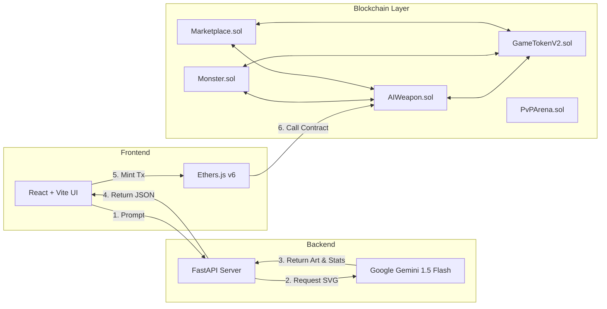
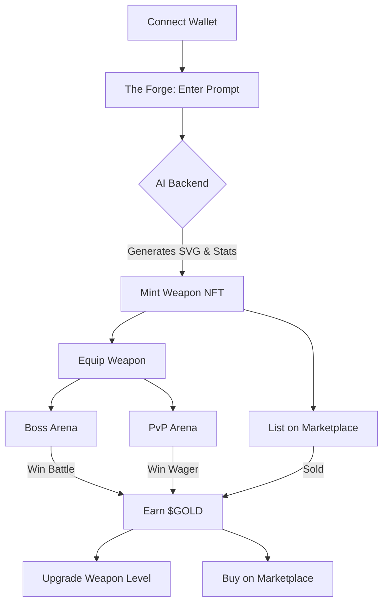
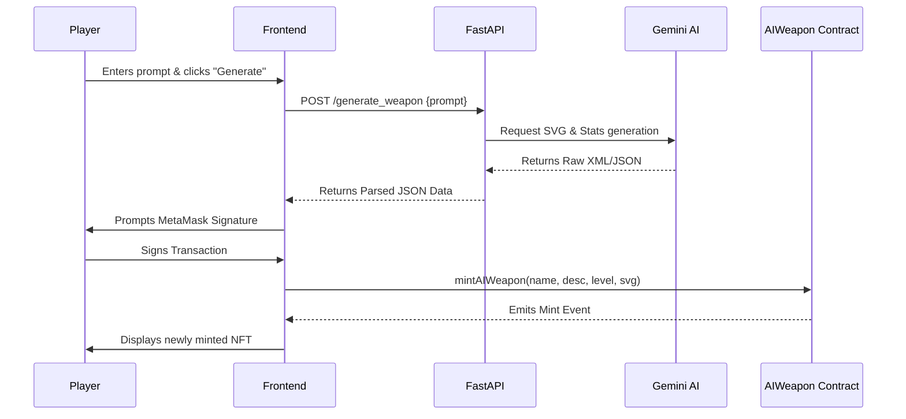

# ARCHITECTURE

## System Overview

The GenAI GameFi Armory uses a hybrid Web2/Web3 architecture to seamlessly integrate Generative AI with decentralized blockchain mechanics. The system is divided into three core layers: the Client (Frontend), the AI Engine (Backend), and the On-Chain Logic (Smart Contracts).

## Modules (System Architecture)

## User Flow 

## 1. Client Layer (Frontend)

The frontend is a reactive Single Page Application (SPA) that acts as the primary interface for players to interact with both the AI generation tools and the blockchain.

- Framework: React.js powered by Vite for fast compilation.
- Web3 Integration: ethers.js (v6) handles wallet connection (MetaMask), transaction signing, and blockchain reads/writes.
- Styling: Custom CSS implementing a "Neon Glassmorphism" cyberpunk theme.
- Key Responsibilities:
  - Capturing user prompts for weapon generation.
  - Rendering Base64 SVG data returned from the blockchain.
  - Tracking and displaying real-time game state (Monster HP, Gold Balance, active PvP lobbies).

## 2. AI Engine Layer (Backend)

A stateless API server responsible for processing prompts and interfacing with Large Language Models (LLMs) to generate game assets.

- Framework: FastAPI (Python).
- AI Integration: LangChain framework routing requests to Google's gemini-1.5-flash model.
- Data Validation: Pydantic models ensure the LLM output strictly adheres to the required JSON schema (Name, Description, Level, and raw SVG code).
- Key Responsibilities:
  - Prompt engineering to instruct the AI to act as a 2D game asset designer.
  - Validating and sanitizing raw SVG markup.
  - Returning formatted JSON to the frontend for minting.

## 3. Blockchain Layer (Smart Contracts)

The decentralized state machine where game logic, asset ownership, and the economy reside.

- Network: Ethereum Virtual Machine (EVM) compatible (Hardhat local/Sepolia).
- Standards: ERC-721 (Weapons) and ERC-20 (Currency).
- Key Responsibilities:
  - Immutable storage of SVG assets and metadata.
  - Trustless calculation of battle outcomes (PvE and PvP).
  - Secure escrow of funds for marketplace trading and PvP wagering.

## Sequence Flow: Weapon Generation & Minting

1. Player enters prompt & clicks "Generate" in Frontend.
2. Frontend sends POST request to FastAPI backend.
3. FastAPI requests SVG & Stats generation from Gemini AI.
4. Gemini AI returns Raw XML/JSON.
5. FastAPI parses and returns JSON Data to Frontend.
6. Frontend prompts MetaMask Signature from Player.
7. Player signs Transaction.
8. Frontend calls mintAIWeapon(name, desc, level, svg) on AIWeapon Contract.
9. AIWeapon Contract emits Mint Event.
10. Frontend displays newly minted NFT.
