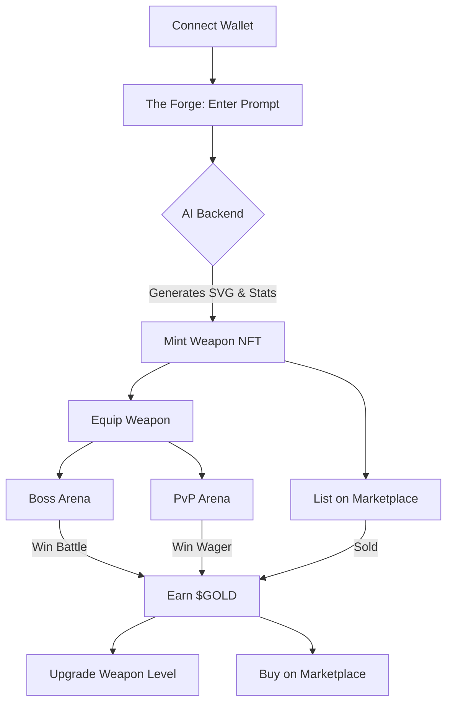
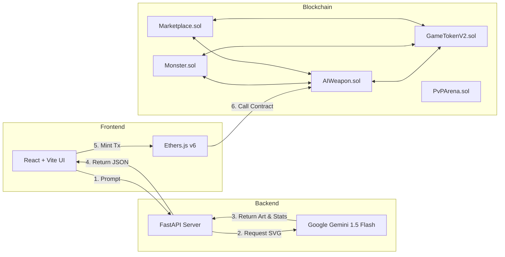

# ⚔️ GenAI GameFi Armory v2.0
A Full-Stack Hybrid Application merging Generative AI (Gemini), DeFi, and Blockchain Gaming.

--------------------------------------------------

# 📖 Overview

GenAI GameFi Armory is a Play-to-Earn (P2E) RPG prototype.

Unlike traditional games that rely on pre-designed assets, this system uses Google Gemini to generate unique weapons based entirely on player prompts.

The AI creates:

- Weapon concepts
- Lore
- Combat stats
- Raw SVG artwork

These generated weapons are then minted as Dynamic On-Chain NFTs (ERC-721).

Players can:

- Battle monsters
- Earn $GOLD tokens (ERC-20)
- Upgrade their NFT weapons
- Fight other players in PvP
- Trade weapons on an open marketplace

--------------------------------------------------

# 🗺️ User Flow & Architecture

## User Journey Flowchart

--------------------------------------------------

## System Architecture

--------------------------------------------------

# 🛠️ Tech Stack

## Blockchain Layer

Smart Contracts: Solidity ^0.8.28

Framework: Hardhat

Standards:
- ERC-721 (NFTs)
- ERC-20 (Tokens)
- OpenZeppelin

Local Network:
- Ganache
- Hardhat Local Node

--------------------------------------------------

## AI & Backend Layer

Server:
Python 3.9+ with FastAPI

AI Integration:
- LangChain
- Google GenAI (gemini-1.5-flash)

Data Validation:
- Pydantic

--------------------------------------------------

## Frontend Layer

Framework:
React + Vite

Web3 Library:
Ethers.js v6

Styling:
- Custom CSS
- Glassmorphism / Cyberpunk Theme

--------------------------------------------------

# 🚀 Getting Started

This project requires three separate terminal instances:

1. Blockchain
2. AI Backend
3. Frontend UI

--------------------------------------------------

# Prerequisites

- Node.js v18+
- Python v3.9+
- MetaMask Browser Extension
- Google Gemini API Key

--------------------------------------------------

# Terminal 1: Blockchain Network & Contracts

Install dependencies:

npm install

Start local blockchain using Ganache or Hardhat node.

Deploy smart contracts:

npx hardhat run scripts/deploy-all.js --network ganache

Important:
Copy the generated contract addresses from the terminal output:

- Token
- Weapon
- Monster
- Market
- PvP

--------------------------------------------------

# Terminal 2: AI Backend Server

Navigate to backend folder:

cd backend

Install Python requirements:

pip install -r requirements.txt

Set Google API Key:

export MY_GOOGLE_KEY="your_api_key_here"

(or place inside main.py)

Start FastAPI server:

uvicorn main:app --reload

Server will run at:

http://127.0.0.1:8000

--------------------------------------------------

# Terminal 3: React Frontend

Navigate to frontend app:

cd my-nft-game

Update Contract Addresses

Open file:

src/App.jsx

Replace:

WEAPON_ADDRESS
MONSTER_ADDRESS
TOKEN_ADDRESS
MARKET_ADDRESS
PVP_ADDRESS

with the addresses generated in Terminal 1.

Start development server:

npm run dev

Open browser:

http://localhost:5173

--------------------------------------------------

# 🎮 Usage Guide

## 1. The Forge (Minting)

Steps:

- Click Connect Wallet to link MetaMask
- Enter a creative prompt in the Neural Weapon Forge

Example prompt:

A venomous cyber-dagger made of green glowing glass

- Click Generate & Mint
- Gemini generates weapon art and stats
- Confirm MetaMask transaction

The weapon is now minted on-chain.

--------------------------------------------------

## 2. The Armory (Equipping)

- Scroll to Inventory
- View your minted SVG weapons
- Click Equip on the weapon you want to take into battle

--------------------------------------------------

## 3. Boss Arena (PvE)

Steps:

- Enter Boss Arena
- Click Attack

Mechanics:

- Damage calculated on-chain
- Based on weapon level

Reward:

Defeating a monster mints $GOLD tokens directly to your wallet.

--------------------------------------------------

## 4. Upgrade Shop

Requirements:

Minimum 10 $GOLD

Upgrade Process:

- Click Upgrade on equipped weapon
- Contract burns the gold
- Weapon Level increases on-chain

Result:

Higher damage in future battles.

--------------------------------------------------

## 5. High Stakes PvP Arena

PvP System:

1. Create a Lobby
2. Stake 50 $GOLD
3. Another player joins and matches the stake

Battle Calculation:

Winner = Weapon Level + Random Luck Roll

Winner receives:

100 $GOLD pot

--------------------------------------------------

## 6. Global Marketplace

Players can trade weapons.

Steps:

1. Select weapon
2. Set price in $GOLD
3. Approve marketplace contract
4. List weapon globally

If sold:

Seller receives $GOLD tokens.
